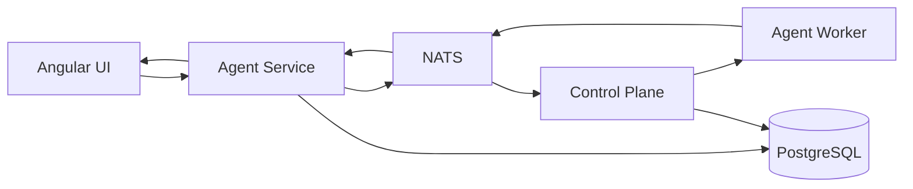

# Agentic Engineering Platform

An open-source orchestration framework for agentic AI workflows with isolated containerized environments. Currently supports Python single agents and CrewAI-based multi-agent systems.

## Why

This project is designed for **personal, scalable, and secure use of agentic AI agents**.

After **14 completed implementation phases**, the platform is **demo-ready** for personal home use. The core architecture, container isolation, Angular UI, NATS messaging, and multi-phase LangGraph workflow are implemented and runnable locally. It is **not yet production-ready** for enterprise deployment.

The first goal is to **orchestrate agentic AI workflows in controlled isolated environments with the ability to use secured remote controls, full open-source usage, and free local LLMs** — each run is sandboxed in a Docker container, driven by NATS, accessible from a remote UI through a trusted VPN, and powered by Ollama for free local inference.

The personal-use goal is to run a stable, single-user home instance that can take a chat request, run an isolated agent workflow on a git repository, and let you inspect and approve changes before they are applied.

## First Goal

1. **Controlled, isolated environment** — every agent workflow runs in its own Docker container with a clean `/workspace`.
2. **Orchestration** — the control-plane listens to NATS commands, creates/terminates worker containers, and coordinates the workflow lifecycle.
3. **Secured remote controls** — the Angular UI connects through the agent-service proxy, authenticated by JWT, so you can start, monitor, and approve workflows from anywhere over a VPN.
4. **Full open-source usage** — the entire stack uses open-source tools, and the default LLM backend is a free local model via Ollama, so no API keys or external payments are required.

## Current State & Goal for Personal Use

**Current state:** `make clean-start` successfully starts PostgreSQL, NATS, the Go control-plane, the Python agent-service, and the Angular UI. You can chat in the UI, trigger a workflow, and observe state events streamed back through the agent-service. The worker now clones the selected repository into `/workspace` before the workflow starts. A custom CrewAI wrapper worker type discovers available agent projects and presents them in the chat session, so the user can pick which multi-agent project to run. The mock/fake LLM provider lets you run this without a GPU.

**Personal-use goal:** A single-user home deployment where you can point the platform at your repositories, run agentic engineering tasks in isolated Docker containers, see real-time progress, and approve or reject sensitive actions before they are committed.

**What is not yet done:**
- **Budget/Cost Enforcement:** `max_tokens`/`max_cost` fields exist but enforcement during LLM calls is not yet implemented.
- **Rate Limiting:** No rate limiting for API endpoints to prevent abuse.
- **Kubernetes Deployment:** Only Docker Compose setup is available; Kubernetes manifests are not yet implemented.

## Next Milestone

Add first-class Kubernetes support alongside the existing `docker-compose` setup so the platform can be deployed to a cluster in addition to a local workstation:

1. **Manifests / Helm chart** — write Deployments, StatefulSets, Services, ConfigMaps, Secrets, Ingress, and PersistentVolumeClaims for NATS, PostgreSQL, control-plane, agent-service, agent-worker, and the web UI.
2. **Worker orchestration** — use the control-plane to spawn agent worker pods (or Kubernetes Jobs) for each workflow, with proper RBAC, resource limits, and network policies.
3. **Observability** — add Prometheus/Grafana metrics, structured logging, and centralized tracing for all services.
4. **GitOps / CI/CD** — automate image builds, tests, and deployments with a GitOps workflow.
5. **Security hardening** — PodSecurityContexts, secrets management, mTLS between services, and ingress with TLS.

## Future Goals

**Self-Improvement** — enable the platform to edit its own code, simulate fixes, and redeploy itself — becoming a self-hosting, self-improving agentic engineering system for personal use.

## Personal Goal: A Strong Starter for Microservice Systems

This repository is intended to be a strong, opinionated starter for building microservice systems. It demonstrates a complete end-to-end pattern — containerized services, NATS event-driven messaging, control-plane/agent-service separation, proxy API, Angular UI, and isolated workers — that can be copied and adapted for other projects beyond agentic AI.

## Key Features

- **Ephemeral, Disposable Workers**: Each run executes in its own throwaway Docker container. The target repository is cloned from GitHub into a container-local `/workspace` — no host files are bind-mounted — so a crashed or misbehaving run leaves the host untouched and can be safely retried. (This is disposability/blast-radius containment, not yet policy-enforced sandboxing — no default-deny egress, credential isolation, or resource limits.)
- **Multi-Agent Orchestration**: Support for Python single agents and CrewAI-based multi-agent systems, including a custom wrapper worker type that discovers available agent projects and lets the user pick one from the chat session
- **Real-Time Event Streaming**: SSE-based live agent activity monitoring with browser reconnection support
- **Human-in-the-Loop Approval**: LangGraph interrupts for sensitive operations requiring human oversight
- **Enterprise-Grade Features**: Multi-tenant user/project management, authentication, and repository integration
- **Event-Driven Architecture**: NATS JetStream with durable consumers for reliable service communication

## Quick Start

### Prerequisites

- Docker and Docker Compose
- Ollama (optional, for free real LLM support)

### Start

```bash
# Build containers and start all services
make start
```

### Start Fresh (Destructive)

**Warning**: `make clean-start` stops all containers and destroys persistent data (PostgreSQL volumes). Use it to clear resources and start fresh.

```bash
# Stop, clean volumes, rebuild, and start
make clean-start
```

### Stop

```bash
make compose-down
```

### Mock LLM

```bash
# Use fake LLM for testing without Ollama
make mock-llm-start
```

### Development Mode (Run Services Locally)

**Use this for testing changed code locally** - run specific services locally while others run in docker-compose:

```bash
# Run web UI locally, other services in docker-compose
make start-local SERVICES=web

# Run web and agent-service locally, others in docker-compose
make start-local SERVICES=web,agent-service

# Run control-plane locally, others in docker-compose
make start-local SERVICES=control-plane
```

To stop the locally running services:

```bash
# Stop web service running locally
make stop-local SERVICES=web

# Stop multiple local services
make stop-local SERVICES=web,agent-service
```

The `start-local` target automatically starts the specified services locally in the background while docker-compose services run in containers. This provides faster development iteration with hot-reload for local services, making it ideal for testing code changes without rebuilding containers. The `stop-local` target safely stops only the locally running services by targeting processes in their specific working directories.

This will start:
- PostgreSQL on port 5433
- Control Plane API on port 8080
- Agent Service on port 8000
- Web UI on port 4200
- NATS JetStream on port 4222

Open [http://localhost:4200](http://localhost:4200) and start chatting.

## Full Free Open Source Setup for Development and API Testing

All tools used for this project are free and open source.

### Prerequisites

- [Docker](https://docs.docker.com/get-docker/) and [Docker Compose](https://docs.docker.com/compose/install/)
- [Ollama](https://ollama.com/download) for local LLM inference (free, no API keys)
- [Go 1.26+](https://go.dev/dl/) for control-plane development
- [Node.js 22+](https://nodejs.org/) and `npm` for the Angular UI
- [Python 3.12+](https://python.org/) and [uv](https://docs.astral.sh/uv/getting-started/installation/) for the Python services
- `make` and `git`

### 1. Install Ollama and a Model

```bash
# Start Ollama server
ollama serve

# Pull a model (used for development/testing)
ollama pull qwen2.5-coder:14b
```

The worker containers connect to `http://host.docker.internal:11434` by default.

### 2. Start the Full Stack

```bash
make clean-start
```

### 3. Test the APIs

The API endpoints are free to test with curl or any HTTP client.

#### Agent Service (port 8000) - Single Entry Point

The UI now accesses only the agent-service, which proxies requests to the control-plane as needed.

```bash
# Register a user
curl -X POST http://localhost:8000/api/auth/register \
  -H "Content-Type: application/json" \
  -d '{"email":"test@example.com","password":"password"}'

# Login
curl -X POST http://localhost:8000/api/auth/login \
  -H "Content-Type: application/json" \
  -d '{"email":"test@example.com","password":"password"}'

# List projects
curl http://localhost:8000/api/projects

# Health check
curl http://localhost:8000/healthz
```

#### Control Plane (port 8080) - Internal Service

The control-plane is now accessed only via the agent-service proxy for UI requests.

```bash
# Direct access (for testing only)
curl http://localhost:8080/api/v1/projects
```

### 4. Run the UI

Open [http://localhost:4200](http://localhost:4200) and register a new account.

### 5. Mock LLM Mode (No GPU Required)

If you do not have a GPU or want to test without Ollama:

```bash
make mock-llm-start
```

This uses the built-in fake LLM provider and runs the full stack locally without external API calls.

## Home Deployment

Deploy the stack on a home server or small cloud instance, expose it securely through a trusted open-source VPN, and chat with your agents from anywhere.

### Example: Deploy with a VPN

1. Install the framework on your home server or VPS.
2. Start the stack:
   ```bash
   make start
   ```
3. Install a trusted open-source VPN app on your server and client devices. Examples:
   - [WireGuard](https://www.wireguard.com/)
   - [Tailscale](https://tailscale.com/) (open source client)
   - [ZeroTier](https://www.zerotier.com/) (open source)
4. Connect your client device to the VPN.
5. Open the Web UI at `http://<server-ip>:4200` in your browser.

### Fully Open Source LLM

For a fully open-source home setup, deploy Ollama locally on the same server:

```bash
ollama serve
```

Worker containers connect to `http://host.docker.internal:11434` by default. Select Ollama models in the UI chat configuration.

## Architecture

This platform is implemented as a **monorepo with 4 microservices**:

- **Control Plane** (Go): Service managing users, organizations, projects, and repositories. Accessed internally via agent-service proxy. See [services/control-plane/README.md](services/control-plane/README.md).
- **Agent Service** (Python): FastAPI service with ChatKit integration, NATS messaging, and proxy endpoints for control-plane APIs. Acts as single entry point for all UI requests. See [services/agent-service/README.md](services/agent-service/README.md).
- **Agent Worker** (Python): CrewAI-based worker for isolated LangGraph workflow execution, communicating only via NATS. See [services/agent-worker/README.md](services/agent-worker/README.md).
- **Web UI** (Angular): Angular 22+ application with standalone components. All API requests routed through agent-service proxy.

### System Flow



### Scalability Considerations

The current 4-service architecture is designed for the POC and personal-use scenarios. When reaching higher scalability goals, certain responsibilities should be divided into additional microservices:

- **Control Plane**: Could split into separate services for user management, project management, and repository operations
- **Agent Service**: Could separate authentication/authorization, chat session management, and NATS command publishing into dedicated services
- **Agent Worker**: Could split worker orchestration (container lifecycle) from workflow execution, and separate different agent framework support (LangGraph vs CrewAI) into specialized workers
- **Observability**: Add dedicated metrics collection, logging aggregation, and tracing services
- **Rate Limiting & Caching**: Extract rate limiting and caching logic into separate services (e.g., Redis-based rate limiter service)
- **File Storage**: Separate blob storage service for workspace artifacts and generated files

This modular design allows the platform to evolve from a single-user home deployment to a multi-tenant enterprise system by extracting services as scale demands.

## Comparison With Related Agent Platforms

This POC is a lightweight, **generic control plane for engineering agents**: it owns the UI, run lifecycle, event streaming, and per-run containerized execution, and it is not tied to a single agent framework. The default engineering workflow is built on LangGraph.

**Command path** (UI → run) and **event path** (run → UI) today:

```text
UI → Agent Service → NATS → Control Plane → per-run Docker worker
Worker → NATS → Agent Service → UI (SSE)
```

Execution modes currently wired into the worker model: a **simple/custom worker** (`single-agent`), a **LangGraph specialist workflow** (`specialist`), and **CrewAI projects** (`crewai`).

> Status note: each run executes in an **ephemeral, disposable Docker container**. Source is cloned from GitHub into a container-local `/workspace` with **no host bind mounts**, so a crashed run causes no host-side harm and can be retried safely. This gives good blast-radius containment, but it is **not** policy-enforced sandboxing yet — there is no default-deny egress, credential isolation, declarative filesystem policy, or strict per-run resource policy. That stricter layer is where OpenShell/NemoClaw would fit later.

| Project | What it is | Relation to this POC | Status |
| --- | --- | --- | --- |
| **This POC** | Generic control plane for engineering agents | Owns UI, runs, events, and ephemeral GitHub-sourced containers | Base platform |
| **CrewAI** | Role-based multi-agent framework | Runs as one worker execution mode | Implemented |
| **LangGraph** | Stateful workflow engine | Powers the default specialist workflow | Implemented |
| **Open Agent Platform** | LangGraph-focused agent-management UI | UX/reference for agent management | Reference only |
| **MetaGPT** | Multi-agent "software company" pattern | Design inspiration; heavier/opinionated | Reference only |
| **SuperAGI** | General autonomous-agent platform | Broader agent management | Reference only |
| **Microsoft Agent Framework** | Unified agent SDK (Semantic Kernel + AutoGen) | Alternative workflow SDK, not a control plane | Reference only |
| **OpenShell** | Policy-enforced sandbox runtime for autonomous agents | Stronger isolation than current Docker workers | Optional future runtime |
| **NemoClaw** | Reference stack/CLI that runs agents inside OpenShell | Packaging/blueprint layer over OpenShell | Optional future runtime |
| **OpenClaw** | Personal AI assistant/operator | Low-level agent UX, not a control plane | Optional integration |

### Main Takeaway

The POC does **not** require NemoClaw or OpenShell to be useful:

```text
This POC           = engineering-agent control plane (UI, runs, events, workers)
CrewAI/LangGraph   = agent workflow/execution layers (used inside workers)
OpenShell/NemoClaw = optional future hardened runtime (replaces plain Docker workers)
```

Today workers are plain, ephemeral Docker containers, kept simple. If stronger isolation is needed later, an OpenShell-style sandbox can be adopted as one runtime option without changing the platform shape.

## Project Structure

```
ai-agents-platform/
├── apps/
│   └── web/                 # Angular 22+ UI
├── services/
│   ├── control-plane/       # Go 1.26+ control plane service
│   ├── agent-service/       # Python 3.12+ API and messaging
│   └── agent-worker/        # Python worker for isolated workflows
├── shared/                  # Shared utilities and test tools
├── docs/                    # Documentation and diagrams
├── PROGRESS.md              # Implementation progress
├── IMPLEMENTATION_PLAN.md   # Detailed implementation plan
└── README.md                # This file
```

## Documentation

- [docs/README.md](docs/README.md) - Architecture diagrams and how to regenerate them
- [docs/COMPLETE_FLOW.md](docs/COMPLETE_FLOW.md) - Complete chat-to-agent flow
- [PROGRESS.md](PROGRESS.md) - Implementation phases, architecture refactoring, and current status
- [services/control-plane/README.md](services/control-plane/README.md) - Control plane service
- [services/agent-service/README.md](services/agent-service/README.md) - Agent service
- [services/agent-worker/README.md](services/agent-worker/README.md) - Agent worker

## Screenshots

### Architecture Diagrams



### NATS Messaging Sequence


## Development

See service-specific READMEs for local development instructions.

## About the Author

**Lihai Aqua** is a senior software engineer focused on distributed systems, Go, Kubernetes, and cloud-native architecture. This work reflects an approach to fast, quality-driven development — designing cloud and cloud-native applications on Kubernetes, solving problems efficiently with the right tools, and applying deep distributed-systems expertise across related domains throughout the full software lifecycle.

### Development Stack Summary
- **Languages:** Go (primary), Python, Bash, Java
- **Frontend & Fullstack:** Angular, TypeScript, JavaScript
- **Infrastructure:** Kubernetes, Docker, Helm, Linux, Azure, AWS
- **Messaging & Data:** NATS, Kafka, PostgreSQL
- **APIs:** gRPC, REST, Protobuf, OpenAPI
- **Build & Automation:** Jenkins, Git, Makefiles, CI/CD Pipelines
- **AI & Security:** Agentic AI, AI Coding Agents, MCP Concepts, Policy-Gated Workflows, Scoped Access, Secrets/SSH Key Handling, Claude
- **Practices:** System Design, TDD, E2E Testing, PR Quality Gates, Production Stability

- Email: lihai2511@gmail.com
- LinkedIn: [linkedin.com/in/lihai-aqua](https://www.linkedin.com/in/lihai-aqua)
- GitHub: [github.com/lihai1](https://github.com/lihai1)
