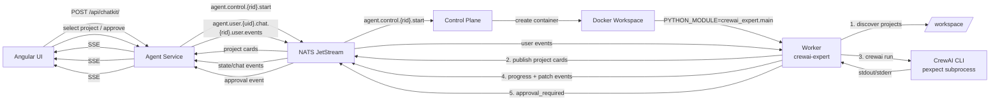

# Agent Worker

Multi-agent worker process for isolated agent workflow execution. Runs in isolated containers with git access, communicating only via NATS. Supports LangGraph workflows (`specialist`, `single-agent`) and CrewAI execution modes (`crewai`, `crewai-expert`).

## Purpose

The agent worker is the **workflow execution layer** of the platform. It is responsible for:
- Executing LangGraph workflows in isolated containers (single-agent and specialist-agent modes)
- Running CrewAI projects with pexpect-based process execution
- Running real specialist agents with LLM integration
- Cloning git repositories to `/workspace`
- Subscribing to NATS commands (run.start, user events)
- Publishing state events back to NATS
- Workspace file operations and git commands
- Recursive workspace scanning for CrewAI project discovery

## Architecture

The agent-worker contains the **complete LangGraph workflow implementation** with real agent executions, plus a CrewAI execution layer. The agent-service (HTTP API layer) does NOT execute workflows - it only publishes NATS commands and streams events.

### Workflow Modes

The worker supports four execution modes:

1. **Single-Agent Mode**: Simplified LangGraph workflow with a single reasoning node that performs the entire task in one step
2. **Specialist-Agent Mode**: Full LangGraph workflow with specialist agents (skills-lead, repo-scout, solution-planner, implementers, validators)
3. **CrewAI Mode**: Executes external CrewAI projects using a pexpect-based process runner with real-time output streaming and project discovery
4. **CrewAI Expert Mode**: LangGraph workflow that discovers CrewAI projects, installs dependencies, generates patches, and pauses for human approval before applying them

## Current State & Goal for Personal Use

**Current state:** The worker runs inside a container created by the control-plane and publishes state and chat events back through NATS. It supports four execution modes selected in the UI. LangGraph variants execute inside the container with optional PostgreSQL checkpointing. CrewAI variants discover projects, stream output, and `crewai-expert` handles dependency patching and approval checkpoints. It is **demo-ready** but not production-ready for real repositories.

**First goal:** Execute agentic AI workflows inside controlled, isolated containers, using a fully open-source stack and free local LLMs via Ollama.

**Personal-use goal:** Execute repository-based engineering tasks in an isolated container, so a single user can ask for changes, review them, and approve or reject them before the workflow finishes.

## Next Milestone

1. **Budget tracking:** Accumulate token/cost usage in `model_factory.py` and enforce `max_tokens`/`max_cost` in the graph.
2. **End-to-end tests:** Add an integration test that starts a container, runs a workflow, and asserts `completed` is reached.
3. **Production readiness:** Harden workspace isolation, egress controls, and resource limits.

See main [README.md](../../README.md) for future goals and milestones.

**Responsibilities:**
- LangGraph workflow execution (`single-agent` and `specialist` modes)
- CrewAI project execution with pexpect-based process runner (`crewai`)
- CrewAI Expert patching workflow with dependency installation and approvals (`crewai-expert`)
- Real specialist agent implementations (skills-lead, repo-scout, solution-planner, implementers, validators)
- Workspace operations (read/write files, git commands, test execution)
- NATS event publishing (`agent.user.{uid}.events.{rid}.state.{event_type}`, `agent.user.{uid}.chat.{rid}.worker.events`, `agent.control.worker.{rid}.ready`)
- NATS user-event subscription (`agent.user.{uid}.chat.{rid}.user.events`)
- CrewAI project discovery and workspace scanning
- Interactive input prompt handling for CrewAI processes

**What it does NOT do:**
- HTTP API endpoints (handled by agent-service)
- PostgreSQL thread/message store (handled by agent-service)
- ChatKit protocol implementation (handled by agent-service)
- Container lifecycle management (handled by control-plane)

## Quick Start

### Build Docker Images

The agent worker uses a modular Dockerfile structure where each worker type only includes the packages it needs:

```bash
# Build base image with common dependencies
docker build -f Dockerfile.base-builder -t agentic-agents-platform-agent-worker-base-builder:latest .

# Build specialist worker (includes playwright, database deps)
docker build -f Dockerfile.specialist -t agentic-agents-platform-agent-worker-specialist:latest .

# Build single-agent worker (includes database deps + playwright for web search)
docker build -f Dockerfile.single-agent -t agentic-agents-platform-agent-worker-single-agent:latest .

# Build CrewAI worker (includes crewai, pexpect)
docker build -f Dockerfile.crewai -t agentic-agents-platform-agent-worker-crewai:latest .

# Build CrewAI Expert worker (includes crewai-expert extras for patching and approvals)
docker build -f Dockerfile.crewai-expert -t agentic-agents-platform-agent-worker-crewai-expert:latest .
```

**Dockerfile Structure:**
- `Dockerfile.base-builder` - Common dependencies (langchain, langgraph, docker, nats)
- `Dockerfile.specialist` - Specialist workflow + playwright + database deps
- `Dockerfile.single-agent` - Single-agent workflow + database deps + playwright (for web search)
- `Dockerfile.crewai` - CrewAI framework + pexpect
- `Dockerfile.crewai-expert` - CrewAI Expert patching workflow + dependency tooling

This modular approach reduces image size and build time by only including packages each worker type actually uses. Note that single-agent includes playwright for web search functionality, while specialist includes it for browser automation tasks.

### Run Worker Manually

The worker entry point depends on the selected `AGENT_TYPE` and the corresponding `PYTHON_MODULE`. For example, to run the CrewAI worker locally for development:

```bash
cd services/agent-worker
PYTHONPATH=/app:/app/internal/agents/crewai/src \
  uv run python -m agent_worker.main --run-id <run_id> --nats-url nats://localhost:4222
```

For the CrewAI Expert worker:

```bash
cd services/agent-worker
PYTHONPATH=/app:/app/internal/agents/crewai-expert/src:/app/internal/agents/crewai/src:/app/internal/agents/patch \
  uv run python -m crewai_expert.main --run-id <run_id> --nats-url nats://localhost:4222
```

In production the container's `PYTHON_MODULE` environment variable selects the entry point automatically.

### Run in Docker

```bash
docker run -e RUN_ID=<run_id> \
           -e REPOSITORY_URL=<repo_url> \
           -e BRANCH=<branch> \
           -e AGENT_TYPE=specialist \
           -e PYTHON_MODULE=agent_worker.main \
           -e NATS_URL=nats://localhost:4222 \
           agentic-agents-platform-agent-worker-specialist:latest
```

### Development Environment

#### Local Development (with docker-compose services)

**Use this for testing changed code locally** - run the agent-worker locally while other services run in docker-compose:

```bash
# From the project root, this starts agent-worker locally and other services in docker-compose
make start-local SERVICES=agent-worker
```

The agent-worker will automatically start in the background, making it ideal for testing code changes without rebuilding containers.

#### Standalone Development

Start the development environment (NATS only):
```bash
make dev-env
```

Stop the development environment:
```bash
make dev-env-down
```

Run integration tests:
```bash
make test-integration
```

Integration tests spin up real worker Docker containers and drive them through NATS. There is no separate `mock-worker` service in `docker-compose.yml`.

## Project Structure

```
agent-worker/
├── internal/
│   ├── agents/             # Agent framework implementations
│   │   ├── crewai/         # CrewAI integration
│   │   ├── crewai-expert/  # CrewAI Expert patching/approval workflow
│   │   ├── single-agent/   # Single-agent mode
│   │   └── specialist/     # Specialist agent workflow
│   ├── handlers/           # NATS message handlers
│   ├── messaging/          # NATS messaging layer
│   ├── skills/             # Skill definitions
│   ├── tools/              # Tool implementations
│   ├── workflow/           # LangGraph workflow definitions
│   └── workspace/          # Workspace operations
├── scripts/                # Container startup scripts
└── tests/
    └── integration/         # Integration tests
```

## Environment Variables

- `RUN_ID`: Run ID for the worker
- `REPOSITORY_URL`: Git repository URL to clone
- `BRANCH`: Git branch to checkout (default: main)
- `GIT_USERNAME`: Git username for authentication (optional)
- `GIT_TOKEN`: Git token for authentication (optional)
- `NATS_URL`: NATS server URL (default: nats://localhost:4222)
- `DATABASE_URL`: PostgreSQL connection string for LangGraph checkpoints (optional)
- `MOCK_MODE`: Enable mock mode for testing (default: false)
- `LLM_PROVIDER`: LLM provider to use (`ollama`, `openai`, `anthropic`, `fake`)
- `MODEL_NAME`: Specific model name for the selected LLM provider
- `AGENT_TYPE`: Agent type to execute (`single-agent`, `specialist`, `crewai`, `crewai-expert`)
- `PYTHON_MODULE`: Python module that serves as the worker entry point (e.g., `agent_worker.main`, `crewai_expert.main`)

## Container Startup

The container runs `scripts/container-start.sh` which:
1. Clones the repository to `/workspace` (or creates a mock structure)
2. Configures git credentials if provided
3. Starts the worker process using the module specified by `PYTHON_MODULE`: `python -m $PYTHON_MODULE --run-id $RUN_ID`

## NATS Integration

The worker uses NATS JetStream with durable consumers. It publishes to:
- `agent.user.{uid}.events.{rid}.state.{event_type}` - State events (created, planning, implementing, completed, etc.)
- `agent.user.{uid}.chat.{rid}.worker.events` - Worker chat output events (`progress_update`, `thread.item.done`)
- `agent.control.worker.{rid}.ready` - Worker ready signal

The worker subscribes to:
- `agent.user.{uid}.chat.{rid}.user.events` - User events (`tool.allowed`, `tool.denied`, `user_input`) from the agent-service
- `agent.control.worker.{rid}.close` - Control close signal for cancellation

The worker auto-starts from environment variables and subscribes to user events for tool approval handling and interactive input prompts.

## Dependencies

See `pyproject.toml` for full dependencies. Key dependencies:
- `langgraph` - Workflow execution
- `langchain-*` - LLM integration
- `nats-py` - NATS messaging
- `docker` - Docker API access
- `pexpect` - Process spawning and output streaming for CrewAI
- `crewai` - CrewAI framework support
- `packaging` - Dependency version parsing (CrewAI Expert)

## Architecture

```
Control Plane creates Docker Workspace → Worker starts (PYTHON_MODULE)
                                          ↓
NATS Command / env vars → Worker → LangGraph Workflow → NATS Events
                                          ↓
                                    /workspace
                                    (git repo)

Control Plane creates Docker Workspace → Worker starts (PYTHON_MODULE)
                                          ↓
NATS Command / env vars → Worker → CrewAI ProcessRunner → NATS Events
                                          ↓
                                    /workspace
                                    (CrewAI project)
```

### CrewAI Components

The CrewAI integration includes:

- **ProcessRunner** (`internal/agents/crewai/src/agent_worker/runner.py`): pexpect-based process runner that spawns CrewAI projects, streams output in real-time, and handles interactive input prompts
- **Bootstrap** (`internal/agents/crewai/src/agent_worker/bootstrap.py`): Workspace resolution, command detection, and recursive CrewAI project discovery
- **CrewAINatsClient** (`internal/agents/crewai/src/agent_worker/nats_client.py`): NATS client tailored for CrewAI worker messaging with state and chat event publishing
- **Events** (`internal/agents/crewai/src/agent_worker/events.py`): Event payload builders for CrewAI state and chat events
- **NATS Handler Integration** (`internal/handlers/nats.py`): NATS message handler that detects CrewAI projects and routes to CrewAI execution

### CrewAI Expert Components

The `crewai-expert` variant is a specialized LangGraph agent that prepares and executes a generic CrewAI agent. It adds:

- **Graph** (`internal/agents/crewai-expert/src/crewai_expert/graph.py`): LangGraph state machine for selection, dependency install, patch generation, and approval
- **Nodes** (`internal/agents/crewai-expert/src/crewai_expert/nodes.py`): State transition nodes
- **State** (`internal/agents/crewai-expert/src/crewai_expert/state.py`): State schema
- **Patch Tools** (`internal/agents/crewai-expert/src/crewai_expert/patch_tools.py`): Patch generation and application
- **Dependency Tools** (`internal/agents/crewai-expert/src/crewai_expert/dependency_tools.py`): Dependency analysis and installation
- **Project Tools** (`internal/agents/crewai-expert/src/crewai_expert/project_tools.py`): CrewAI project discovery and metadata
- **Approvals** (`internal/agents/crewai-expert/src/crewai_expert/approvals.py`): Approval request/response handling
- **Worker** (`internal/agents/crewai-expert/src/crewai_expert/worker.py`) and **Main** (`internal/agents/crewai-expert/src/crewai_expert/main.py`): Entry points for the CrewAI Expert worker

### CrewAI Expert Flow

A simplified view of the `crewai-expert` execution flow:



The source file is at [`docs/crewai-expert-flow.mmd`](../docs/crewai-expert-flow.mmd) and the rendered SVG is at [`docs/svg/crewai-expert-flow.svg`](../docs/svg/crewai-expert-flow.svg).

**Flow summary:**
1. The UI sends a chat message to the agent-service, which publishes `agent.control.{run_id}.start`.
2. The control-plane creates a Docker workspace using the `crewai-expert` worker image and starts `crewai_expert.main`.
3. The worker scans `/workspace`, discovers CrewAI projects, and publishes them as selectable cards to the UI via NATS.
4. The user selects a project; the UI forwards the event as `agent.user.{uid}.chat.{rid}.user.events`.
5. The worker prepares the CrewAI project: it inspects dependencies, generates patches, pauses at approval checkpoints, applies patches, and syncs dependencies.
6. The worker spawns the CrewAI CLI (`crewai run`) via pexpect, streams stdout/stderr, and publishes progress updates.
7. Final state and chat events are routed back through NATS to the agent-service and streamed to the UI via SSE.

## Separation from Agent Service

- **Agent Service**: HTTP API layer (`services/agent-service`)
  - Exposes REST endpoints
  - Manages ChatKit database records
  - Publishes commands to NATS
  - Handles ChatKit protocol
  - Proxies control-plane APIs
  
- **Agent Worker**: Workflow execution layer (`services/agent-worker`)
  - Runs in isolated containers created by the control-plane
  - Executes LangGraph workflows (`single-agent`, `specialist`)
  - Executes CrewAI projects via `ProcessRunner` (`crewai`)
  - Executes CrewAI Expert patching workflow (`crewai-expert`)
  - Subscribes to NATS user events
  - Scans workspace for CrewAI projects

## Testing

### Integration Tests

Start development environment (NATS only):
```bash
make dev-env
```

Stop development environment:
```bash
make dev-env-down
```

Run integration tests:
```bash
make test-integration
```

Integration tests require NATS to be running locally. The tests verify:
- Workflow execution and state event publishing
- Event publishing to agent.user.{uid}.events.{rid}.state.* and agent.user.{uid}.chat.{rid}.worker.events subjects
